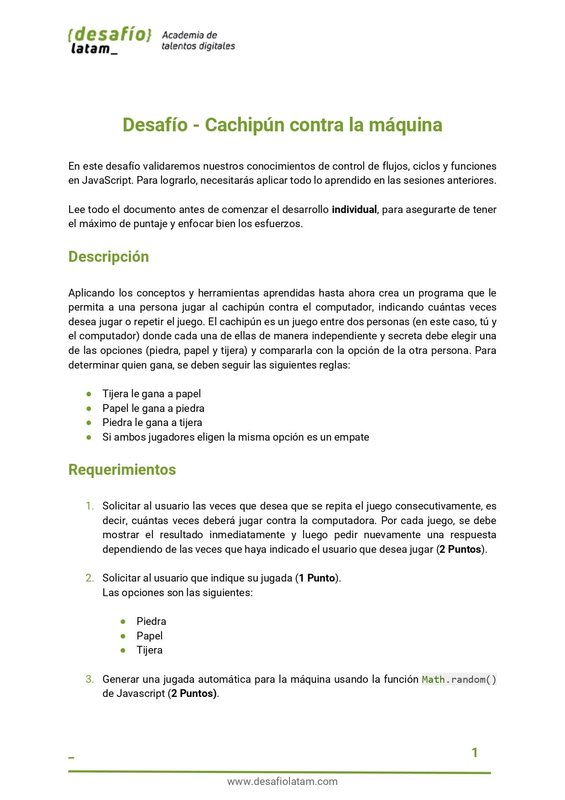
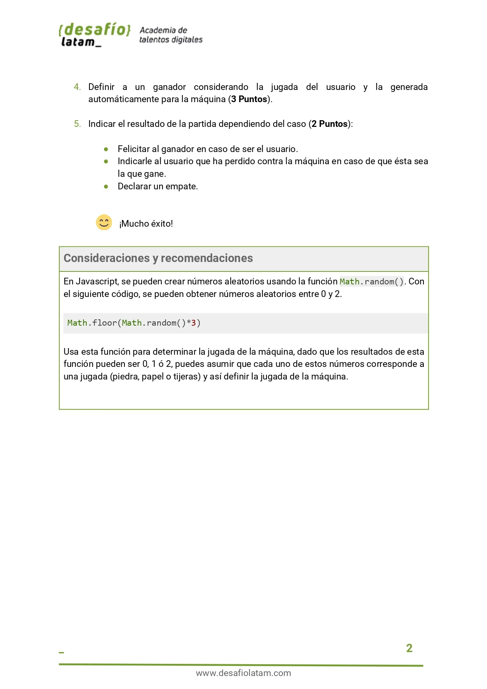
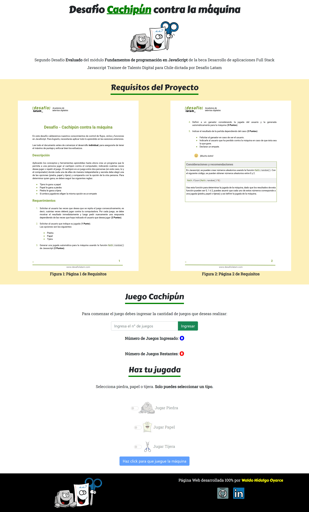
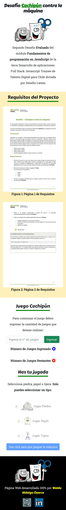
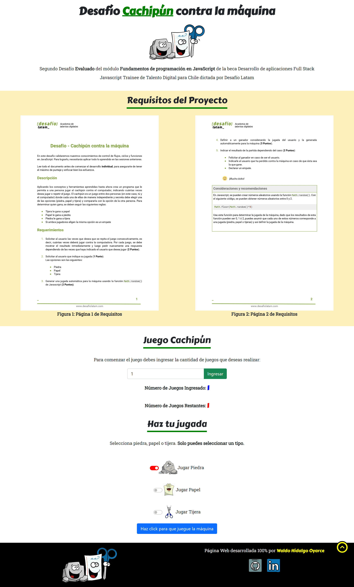
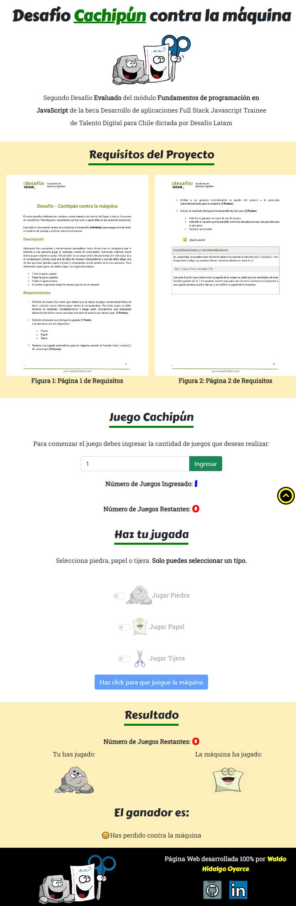

Este repositorio contiene el código con el cual he creado mi proyecto para superar el primer desafío evaluado del módulo tres llamado **Fundamentos de programación en JavaScript** de la beca **Desarrollo de aplicaciones Full Stack Javascript Trainee V2.0** dictado por Desafío Latam.

Las tecnologías que he utilizado son las siguientes:

Junto con uso intensivo de la API del DOM.

Los requisitos del proyecto son los siguientes:

He ido más allá de lo solicitado en el proyecto desafiándome en implementar nuevas cosas. En primer lugar he mezclado JavaScript con HTML y CSS para crear una página web que permite jugar al cachipún de manera sencilla. Mi proyecto es 100% responsivo para lo cual he utilizando CSS Grid.
A continuación muestro mi proyecto en pantallas grandes y small:

### 1. Pantallas Grandes

### 2. Pantallas Small

Mi proyecto al inicio de su ejecución muestra un input de tipo **text** el cual permite el ingreso del número de veces a jugar. Dicho input presenta validación **inmediata** de caracteres ingresados de modo tal que NO es posible ingresar caracteres distintos de números. Mi proyecto presenta una sección llamada **Haz tu jugada** la cual permite realizar jugadas por el usuario. Al principio del proyecto los input y el botón de dicha sección estan **deshabilitados** y cuando se ingresa un número de juegos mayor que cero, dichos inputs se desbloquean y se habilitan.

### 3. Número de juegos positivo e input habilitados

Una vez que se habilitan los inputs de dicha sección, se puede realizar una elección ya sea piedra, papel y tijera. Al realizar una selección, se habilita el botón para que la máquina haga su elección aleatoria. Cuando se hace click en dicho botón muestro una sección llamada **Resultados** con el número de juegos restantes,las elecciones hechas por cada jugador y quién ha ganado:

En mi proyecto he utilizado los siguientes componentes nuevos de bootstrap 5: [switches de bootstrap](https://getbootstrap.com/docs/5.0/forms/checks-radios/#switches) los cuales he personalizado e [input groups](https://getbootstrap.com/docs/5.0/forms/input-group/#button-addons) el cual también he personalizado. Por último, he implementado usando JavaScript un botón para hacer scroll al top de la página,lightbox para las imagenes de los requisitos del proyecto y una transición ease-in-out sobre la sección resultados al renderizarse o ocultarse.
